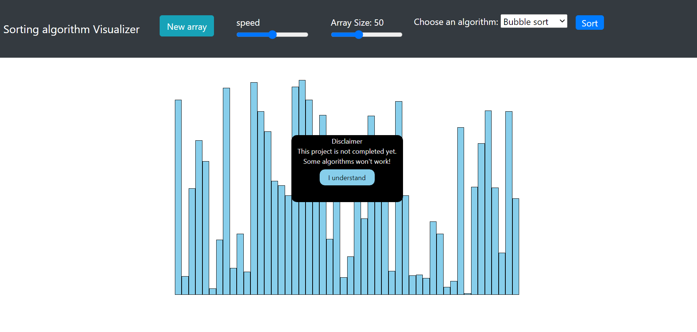
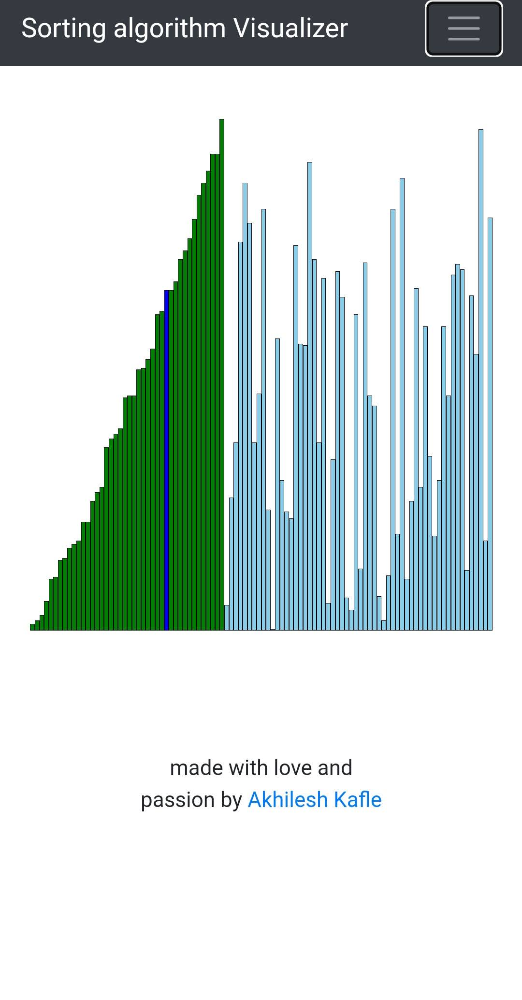

# Sorting Visualizer
This is simple sorting visualization project made using javascript.
* Bubble Sort
* Insertion Sort
* Merge Sort
* Quick Sort
* Selection Sort
---
# Project status
This project is still under development. Only two algorithms-bubble sort and insertion sort are ready to visualize.

[Project link](https://akhilesh-kafle.github.io/SortingVisualizer)
---

# Technologies 

This project is created with:
* HTML5
* CSS3
* Javascript ES2015
* Bootstrap 5
---

# Library 
This project uses Bootstrap5 for responsive navbar. 

---

Bubble sort is sorted

Insertion sort is sorted in mobile device

---
# Features
* Responsive 
* Can adjust speed while sorting
* Other buttons and sliders are disabled while sorting

---
# Purpose 
There is no biggie purpose of this project. I just made to learn javascript and web development.

---
https://akhilesh-kafle.github.io/SortingVisualizer

made with :sparkling_heart: and passion

